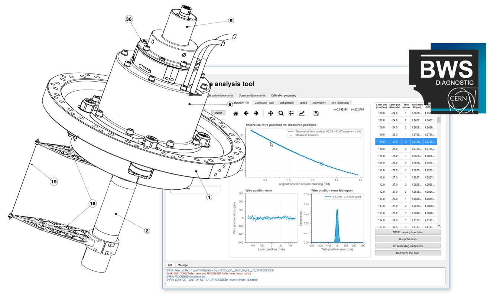

# BWS-diagnostic

**BWS-diagnostic** is a framework to asses, monitor and diagnose the new generation of rotational BWS developped at **CERN** inside the **BE-BI-PM** section.

It has been written in **Python 3.7** and is available both as a **library** and used in an **expert GUI**.

For more info go to the [complete documentation (GitHub wiki)](https://github.com/LionelGarcia/BWS-diagnostic/wiki)



**Type in Anaconda Prompt and as Administrator:**


## Distribution in CERN Windows Machines

**Requirements:**

1. Python 3.7 Distribution: [Anaconda](https://www.anaconda.com/download/)
2. Python Development IDE: [PyCharm](https://www.jetbrains.com/pycharm/)
3. Git for windows: [git](https://git-scm.com/downloads)

**Configuration:**

1. In the Anaconda promt execute the following commands:
```
conda install -c anaconda pyqt
conda install -c conda-forge nptdms
pip install configparser
python -m pip install --upgrade scipy
```
2. Add to the environment variable "PATH" the following
```
path\Anaconda3
path\Anaconda3\Scripts
path\Anaconda3\Library\bin
```
where 'path' is the Anaconda3 installation directory.


## Distribution in CERN Linux Machines

**Installation:**

1. Ensure that EOS is mounted and you have access:

   If connected to cwe-513-vol191 type --> eosfusebind

2. Add in ~.bash_profile the following lines to use CO Python 3.6
```
    PATH=$PATH:$HOME/bin
    PATH="/user/bdisoft/operational/bin/Python/PRO/bin:$PATH"
    export PATH
```
3. Enter the application directory:
```
    cd /eos/project/l/liu-bws/Calibrations/App/BWS-Calibration
```
4. Install application dependencies in your user space:
```
    pip install --user -r requisites.txt
```
5. Once done the application can be launched

**Launching the App:**

1. Access to the App directory in EOS:
```
    cd /eos/project/l/liu-bws/Calibrations/App/BWS-Calibration
```
2. Launch the application:
```
   python bws_calibration_app.py
```


